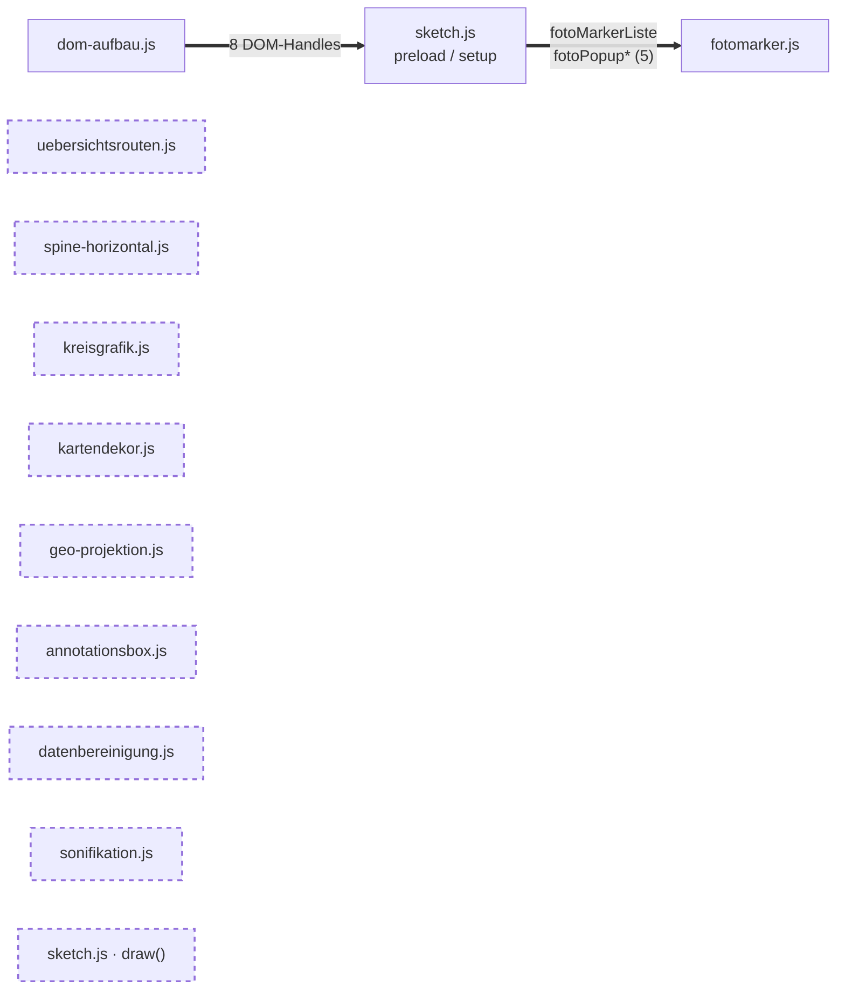
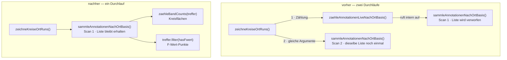

# Best-Practice-Review

Prüfung des Codes gegen fünf Kriterien: globale Variablen, Single
Responsibility, toter Code, DRY und der `draw()`-Loop.

**Erhoben am 22. August 2026** über alle zwölf Module (damals 4532 Zeilen) plus
`index.html`. **Fortgeschrieben bis zum 8. September 2026** — die Module zählen
heute 5829 Zeilen, und die Befunde unten sind laufend nachgezogen worden: was
umgesetzt ist, trägt eine Erledigt-Markierung mit der Fundstelle im heutigen
Code, die ursprüngliche Begründung bleibt jeweils als Nachvollzug darunter
stehen. Datumsangaben im Text beziehen sich deshalb je nach Abschnitt auf
verschiedene Stände; die Zeilenverweise sind auf den 8. September geprüft.

**Stand der Umsetzung.** Der Befund wurde am 22. August 2026 erhoben. Seither
umgesetzt: die Konsolidierung der Radius-Formel samt der beiden daran
hängenden Befunde (Rückgabewert von `zeichneKreiseFuerRun()`, Namensverdeckung
in `zeichneFwertPunkte()`), der doppelte Vollscan pro Frame samt dem
doppelten `wohnungFilterFuerOrt()`-Aufruf, die drei Canvas-Zustands-Befunde
in `kreisgrafik.js` (dort klammern sich jetzt alle sechs zeichnenden
Funktionen einheitlich mit `push()`/`pop()`), die Fremdschreibzugriffe aus
`draw()` samt dem `kapitelHover`-Knoten sowie die Kapitel-1-Datenregeln, die
im Zeichenmodul standen. Die betroffenen Zeilen unten sind als **erledigt**
markiert und tragen die Fundstelle im heutigen Code. **Diese Aufzählung gibt
den Stand vom 22. August wieder** — seither sind unter anderem der tote Zweig
der Sonifikation, die Konstanten-Reinigung, der Umbau auf `noLoop()`/`redraw()`
und die Rücknahme der Modulkapselung dazugekommen; massgeblich sind die
Erledigt-Markierungen an den Befunden selbst. Die Namensverdeckung wurde bei
dieser Gelegenheit erstmals
systematisch über alle Module geprüft — Ergebnis unter
[Globale Variablen](#namensverdeckung-systematisch-nachgeprüft).

**Randbedingung, die jede Bewertung hier färbt:** Das Projekt nutzt keine
ES-Module (siehe [architektur.md](architektur.md)). Jeder Name landet im
globalen Scope. „Modulintern" heisst deshalb nirgends *technisch* gekapselt,
sondern nur: faktisch greift kein anderes Modul darauf zu.

---

## Priorisierte Gesamtliste

| Nutzen | Befund | Kriterium |
|---|---|---|
| **hoch** | ~~Dieselbe Radius-Formel liegt fünfmal im Code, an vier Stellen als Kopie~~ — **erledigt**, jetzt `groessterKreisRadius()` in `datenbereinigung.js:337` | DRY |
| **hoch** | ~~Pro Frame und Ortskreis wird `daten.annotationen` zweimal vollständig durchlaufen~~ — **erledigt**, jetzt ein Scan über `zaehleBandCounts()` | DRY |
| **hoch** | ~~`zeichneKreiseFuerRun()` liefert den Radius nur als Nebenprodukt des Zeichnens~~ — **erledigt**, die Funktion gibt nichts mehr zurück | Single Responsibility |
| **hoch** | ~~Parameter `kreisRadius` verdeckt die gleichnamige globale Funktion~~ — **erledigt**, heisst jetzt `radius` | Globale Variablen |
| **mittel** | ~~`draw()` schreibt in Variablen von drei fremden Modulen~~ — **erledigt**, alle fünf Zugriffe verlagert | Globale Variablen |
| **mittel** | ~~`zeichneKreisLabels()` setzt sechs p5-Zeichenzustände und stellt keinen zurück~~ — **erledigt**, `push()`/`pop()` | Single Responsibility |
| **mittel** | ~~`zeichneUebersichtsrouten()` zeichnet und setzt dabei `kapitelHover`~~ — **erledigt**, `draw()` zieht nichts mehr nach | Single Responsibility |
| **mittel** | ~~139 der 266 Namen sind modulintern~~ — die Kapselung wurde gebaut und auf Dozenten-Wunsch **wieder entfernt**; heute sind 321 der 476 Namen faktisch modulintern, aber alle global sichtbar | Globale Variablen |
| **mittel** | ~~Kapitel-1-Datenregeln stehen im Zeichenmodul `kreisgrafik.js`~~ — **erledigt**, jetzt `ortRunSichtbar()` in `datenbereinigung.js` | Single Responsibility |
| **mittel** | ~~`zeichneHalbkreis`/`zeichneVollkreis` setzen `globalCompositeOperation` hart zurück~~ — **erledigt**, `push()`/`pop()` | Single Responsibility |
| **niedrig** | `draw()` läuft mit 557 Zeilen als eine Funktion | Single Responsibility |
| **niedrig** | ~~`noLoop()`/`redraw()` wäre möglich, aber der Umbau ist gross und der Gewinn klein~~ — **erledigt**, `noLoop()` in `sketch.js:323`, vier Auslöser und die selbstabschaltende Schleife `planeRedraw()` | draw()-Loop |
| **niedrig** | ~~Farbwerte aus `KREIS_KATEGORIEN` werden an drei Stellen in drei Formate übersetzt~~ — **erledigt**, jetzt `rgbZuHex()` in `datenbereinigung.js:27` | DRY |
| **niedrig** | ~~Das Font-Literal `'Source Sans 3', sans-serif` steht zwölfmal im Code~~ — **erledigt**, jetzt `SCHRIFT_SANS` in `datenbereinigung.js:100` | DRY |
| **niedrig** | ~~`wohnungFilterFuerOrt()` wird zweimal mit demselben Argument aufgerufen~~ — **erledigt** | DRY |
| **niedrig** | Sechs Stellen verdecken p5-Globals (`color`, `text` ×4, `key`) — alle heute wirkungslos | Globale Variablen |
| — | **Toter Code: nichts gefunden.** Alle 82 Funktionen sind erreichbar | Toter Code |

---

## Globale Variablen — die Kapselung ist zurückgenommen

**Ist-Stand.** Es gibt keine Kapselung mehr. Alle zwölf Module deklarieren ihre
Namen direkt im globalen Scope; keine Datei steht in einer IIFE, und
`window.X = X` kommt nirgends mehr vor. „Modulintern" heisst hier deshalb nicht
*technisch* unsichtbar, sondern nur: faktisch greift kein anderes Modul darauf
zu. Die Regeln, die das Projekt stattdessen trägt — projektweite
Namenseindeutigkeit, keine Verdeckung von p5- oder Strudel-Namen, die fünf
Hooks am `window` — stehen in [architektur.md](architektur.md).

Frisch am Code erhoben (Deklarationen auf oberster Klammertiefe, kommentar- und
stringbereinigt):

| Modul | Namen gesamt | nur modulintern | extern genutzt | Anteil intern |
|---|---|---|---|---|
| `ortsveraenderung.js` | 38 | 35 | 3 | 92 % |
| `kreisgrafik.js` | 130 | 117 | 13 | 90 % |
| `kartendekor.js` | 18 | 15 | 3 | 83 % |
| `sonifikation.js` | 60 | 50 | 10 | 83 % |
| `annotationsbox.js` | 8 | 6 | 2 | 75 % |
| `sketch.js` | 91 | 60 | 31 | 66 % |
| `spine-horizontal.js` | 26 | 16 | 10 | 62 % |
| `uebersichtsrouten.js` | 20 | 8 | 12 | 40 % |
| `datenbereinigung.js` | 53 | 12 | 41 | 23 % |
| `dom-aufbau.js` | 5 | 1 | 4 | 20 % |
| `fotomarker.js` | 14 | 1 | 13 | 7 % |
| `geo-projektion.js` | 13 | 0 | 13 | 0 % |
| **Summe** | **476** | **321** | **155** | 67 % |

Das sind 187 Funktionen und 289 Variablen/Konstanten. Die fünf p5-Hooks zählen
als extern, weil p5 sie am `window` sucht. `datenbereinigung.js` ist mit 41
extern gelesenen Namen die gemeinsame Ebene des Projekts, `geo-projektion.js`
gibt alles heraus.

**ACHTUNG diese Zahlen sind nicht mit denen im Nachvollzug unten vergleichbar.**
Dort wurden 267 Namen gezählt, hier 476 — nicht weil das Projekt gewachsen
wäre, sondern weil damals neun Module in einer IIFE standen und nur die
Deklarationen der jeweiligen Kapsel gezählt wurden. Wer die Reihen
gegenüberstellt, vergleicht zwei verschiedene Fragen.

### Nachvollzug: der Kapselungsversuch und warum er wieder wegkam

Alles Folgende beschreibt einen **früheren Stand**. Neun der zwölf Module
standen zeitweise in einer IIFE und gaben ihre Schnittstelle über
`window.X = X` heraus, veränderliche Werte über eine Lesebindung. Diese
Kapselung ist auf Wunsch des Dozenten wieder entfernt worden — für ein Projekt
ohne Bundler und ohne ES-Module war sie mehr Zeremonie als Schutz, und sie
machte jede Datei um eine Einrückungsebene und einen Exportblock länger. Die
Analyse bleibt hier stehen, weil die Zuordnung intern/extern, die sie erhoben
hat, weiter gilt: sie ist die Grundlage der Tabelle oben.

Erhoben wurde damals so: **262 Namen im globalen Scope**, 90 Funktionen und
172 Variablen/Konstanten, davon **124 nur im eigenen Modul gebraucht**. Fünf
sind p5-Hooks, die global bleiben müssen — blieben **119 Kandidaten** für
Modul-Scope.

Die Zahl war im Lauf der Schritte *gestiegen*, nicht gefallen: Jede
Konsolidierung hatte Logik aus fremden Modulen in ihr Heimatmodul geholt und
dort intern gemacht. `ortRunSichtbar()` machte fünf Namen in
`datenbereinigung.js` intern, `kapitelHatEigeneAnsicht()` das vielgelesene
`kapitelKarten` in `sketch.js`, `spieleSonifikationFuer()` die beiden
`spiele*SonifikationAudio` in `sonifikation.js`.

#### Wie viel jedes Modul nach aussen gab

| Modul | damals gekapselt | Namen gesamt | nur modulintern | extern genutzt | Anteil intern |
|---|---|---|---|---|---|
| `ortsveraenderung.js` | ja (8 Exporte) | 44 | 36 | 8 | 81 % |
| `sonifikation.js` | ja (4 Exporte) | 21 | 17 | 4 | 80 % |
| `annotationsbox.js` | ja (2 Exporte) | 7 | 5 | 2 | 71 % |
| `kreisgrafik.js` | ja (5 Exporte) | 13 | 8 | 5 | 61 % |
| `spine-horizontal.js` | ja (11 Exporte) | 25 | 14 | 11 | 56 % |
| `kartendekor.js` | ja (2 Exporte) | 4 | 2 | 2 | 50 % |
| `sketch.js` | ja (35 Exporte) | 70 | 35 | 35 | 50 % |
| `uebersichtsrouten.js` | ja (10 Exporte) | 16 | 6 | 10 | 38 % |
| `datenbereinigung.js` | ja (26 Exporte) | 38 | 12 | 26 | 32 % |
| `geo-projektion.js` | — *(geprüft, bewusst nicht)* | 9 | 0 | 9 | 0 % |
| `fotomarker.js` | nein | 14 | 0 | 14 | 0 % |
| `dom-aufbau.js` | nein | 6 | 0 | 6 | 0 % |
| **Summe** | **9 von 12** | **267** | **135** | **132** | 51 % |

Der Kapselungsstand wurde strukturell erhoben, nicht per Textsuche: gesucht
wurde eine umschliessende sofort ausgeführte Funktion über die Klammertiefe auf
kommentarbereinigtem Quelltext, nicht eine bestimmte Schreibweise. Zum damaligen
Abschluss standen neun der zwölf Module in einer IIFE, und **alle 135
modulinternen Namen waren aus dem globalen Scope entfernt.** Die drei übrigen
(`geo-projektion.js`, `fotomarker.js`, `dom-aufbau.js`) blieben bewusst
ungekapselt: Bei ihnen wurde jeder Top-Level-Name von aussen gelesen, eine
Kapsel hätte null gebracht. Bei `fotomarker.js` einzeln gegengeprüft.

Der Weg dorthin lief über vier Vorarbeiten, die im Verlauf nötig wurden:

| Vorarbeit | wofür |
|---|---|
| Regeln ins Heimatmodul holen (`ortRunSichtbar`, `kapitelHatEigeneAnsicht`, `spieleSonifikationFuer`) | verschob die Zuordnung intern/extern, musste vor der Kapselung geschehen — **diese Vorarbeit gilt weiter**, sie hat die Modulschnitte verbessert, unabhängig von der Kapsel |
| Fremdschreibzugriffe aus `draw()` | `draw()` schrieb je Frame in drei fremde Module |
| Handler-Dreieck | `uebersichtsrouten.js` schrieb in `spine-horizontal.js` und `sketch.js` — blockierte beide |
| Rückgabewerte statt Seiteneffekte in `dom-aufbau.js` | acht DOM-Handles — der letzte Blocker für `sketch.js` |

Von den ursprünglich 21 modulübergreifenden Schreibzugriffen blieben **7**
übrig, alle von `sketch.js` nach `fotomarker.js` (einmalige Initialisierung
in `preload`/`setup`). Sie blockierten nur `fotomarker.js`, wo ohnehin nichts
zu kapseln gewesen wäre. Die Reduktion von 21 auf 7 ist der bleibende Gewinn
dieser Vorarbeit — sie gilt unabhängig von der zurückgenommenen Kapselung.

#### Korrektur: zwölf Namen waren nie extern

Die Zahlen für `sketch.js` waren bisher falsch — statt 27/42 sind es
**39/30**. Grund: Die Erhebung zählte `index.html` als Referenzquelle mit,
und zwölf `sketch.js`-Namen kommen dort vor: `stage`, `naechstesKapitel`,
`annotationInner`, `annotationTag`, `annotationBar`, `scrollFortschritt`,
`scrollFortschrittFuellung`, `legendeBox`, `legendeTab`, `prologBox`,
`prologTab`, `grafikPlayButton`.

**Es sind ausnahmslos HTML-`id`-Attribute**, keine Code-Referenzen —
`index.html` enthält gar kein Inline-Skript (geprüft). Dieselbe Falle wie im
Abschnitt [Toter Code](#toter-code), wo `id="naechstesKapitel"` schon einmal
eine Funktion fälschlich als tot gemeldet hatte.

Geprüft, ob dadurch bei den acht damals gekapselten Modulen etwas
fälschlich exportiert wurde: **nein** — der Effekt trat nur bei `sketch.js`
auf. Für künftige Erhebungen gilt weiterhin: `index.html` gehört nur dann als
Referenzquelle dazu, wenn sie ein Inline-Skript enthält. Sie enthält keines
(erneut geprüft).

**`geo-projektion.js` wurde geprüft und bewusst ausgelassen.** Alle neun
Namen wurden extern gelesen, keiner war intern — eine Kapsel hätte rund
20 Zeilen gekostet und null Namen entfernt. Dasselbe galt für `fotomarker.js`
und `dom-aufbau.js`: drei reine Werkzeugkästen, die alles nach aussen geben.

#### Veränderliche Exporte: die Hürde, an der das Muster teuer wurde

Bei `sonifikation.js` trat erstmals ein Fall auf, den die ersten beiden
Kapselungen nicht hatten: ein **veränderliches** `let`, das drinnen
umgeschaltet und draussen gelesen wird. `window.x = x` kopiert dabei nur den
Wert beim Laden — die Flagge wäre für immer `false` geblieben. Empirisch
nachgestellt und bestätigt; im konkreten Fall hätte `beendeSonifikationAudio()`
von den drei externen Stellen nie mehr gerufen werden können, der Ton wäre
beim Ansichtswechsel weitergelaufen.

Die Lösung dort war eine **Lesebindung** über `Object.defineProperty(window, …,
{ get })`. Sie hielt die Aufrufstellen unverändert, las live und liess
Schreibzugriffe von aussen wirkungslos — was der tatsächlichen Nutzung
entsprach, denn alle drei Leser lesen nur.

**Das trug aber nur, solange von aussen nicht geschrieben wurde.** Eine
Erhebung über alle Module zeigte, wo das der Fall war — und genau diese Liste
war der Grund, das Muster als zu aufwendig zu bewerten:

| Modul | veränderliche Exporte | von aussen geschrieben? |
|---|---|---|
| `geo-projektion.js` | 5 (`mapOffsetX/Y`, drei Bboxen) | nein → Lesebindung genügt |
| `uebersichtsrouten.js` | 3 (`zoomedKapitel`, `kapitelZoomAmount`, `kapitelHover`) | nein → Lesebindung genügt |
| `spine-horizontal.js` | 5 | **ja** — `uebersichtsrouten.js` schreibt `grafikSpielt`, `grafikFortschritt`, `grafikPlayAusblendStart` |
| `fotomarker.js` | 9 | **ja** — `sketch.js` füllt die fünf `fotoPopup*`-Handles und `fotoMarkerListe` |
| `sketch.js` | viele | **ja** — `dom-aufbau.js` (9 DOM-Handles), `spine-horizontal.js` und `uebersichtsrouten.js` (`kapitelAnsichtsModus`) |

Damit war die Reihenfolge für den Rest vorgezeichnet: `geo-projektion.js` und
`uebersichtsrouten.js` wären mit dem bekannten Muster plus Lesebindung machbar
gewesen. `spine-horizontal.js`, `fotomarker.js` und `sketch.js` hätten vorher
gebraucht, dass die Fremdschreibzugriffe aufgelöst werden. Dass drei von zwölf
Modulen eine zusätzliche Umbaustufe gebraucht hätten, nur um eine Sichtbarkeit
herzustellen, die ohne Bundler ohnehin niemand erzwingt, gab den Ausschlag für
die Rücknahme.

*Nebenbemerkung zur Erhebung:* Treffer „gelesen von index.html" sind zum Teil
falsch — gleichnamige HTML-`id`-Attribute (`id="stage"`, `id="legendeBox"`),
dieselbe Falle wie im Abschnitt [Toter Code](#toter-code).

#### A3 gehörte nicht in die Sonifikations-Kapselung — erledigt

**Erledigt.** `spineEintraegeKapitel` (`spine-horizontal.js:27`) ist
modulintern; der Cache geht nicht mehr hinaus. Beide früheren Direktleser
holen ihre Einträge über den Accessor `spineEintraegeFuer()`
(`spine-horizontal.js:72`) — `sonifikation.js:292` und `sketch.js:542`. Die Begründung von damals
steht zum Nachvollziehen hier:

`sonifikation.js` las `spineEintraegeKapitel[nr]` direkt. Geprüft, ob
sich das mit der Kapselung mitlösen lässt — **nein**, aus zwei Gründen:

1. **Es würde nichts modulintern machen.** `spineEintraegeKapitel` wurde von
   *zwei* fremden Stellen gelesen, in `sonifikation.js` und in `sketch.js`.
   Nur die eine umzustellen ändert an der Sichtbarkeit nichts.
2. **`stelleSpineDatenBereit()` ist kein Accessor.** Die Funktion gibt nichts
   zurück, sie *füllt* die beiden Caches. `sonifikation.js` könnte die
   Einträge damit gar nicht holen — es bräuchte eine neue Funktion
   (`spineEintraegeFuer(nr)`), also einen Entwurfsschritt, nicht einen
   mechanischen Austausch.

A3 gehörte deshalb zur Kapselung von `spine-horizontal.js`, wo beide Leser
zusammen behandelt wurden. Der Accessor `spineEintraegeFuer()` ist geblieben,
auch nachdem die Kapsel wieder wegfiel — er ist die bessere Schnittstelle,
unabhängig von der Sichtbarkeit.

#### Kandidaten für Modul-Scope, wie sie damals abgearbeitet wurden

| Fundstelle | Befund | Priorität | Begründung |
|---|---|---|---|
| ~~`ortsveraenderung.js:42-302`~~ | **Erledigt (damals).** Die Datei stand in einer IIFE und gab nur acht Namen über `window.*` heraus; 36 waren modulintern | mittel | Erster gekapselter Modul. Der Rumpf ist bewusst nicht eingerückt — bei 656 Zeilen hätte das jede Zeile als geändert markiert und `git blame` zerstört; so ist der Diff eine reine Einfügung von 30 Zeilen. Nachgewiesen: Exportliste exakt (8 gebraucht, 8 exportiert, nichts fehlt oder ist überflüssig), Rumpf byteweise unverändert, alle 36 internen Namen von aussen unsichtbar, alle 8 Exportwerte identisch zur Vorher-Fassung |
| ~~`sonifikation.js:44-184`~~ | **Erledigt (damals).** Die Datei stand in einer IIFE und gab vier Namen heraus; 17 waren modulintern, darunter der gesamte Zustand (`sonifikationDaten`, `sonifikationBereit`, `sonifikationSpielplan`, `sonifikationTimeoutId`) | mittel | Drittes gekapseltes Modul. **Erster Fall mit veränderlichem Export:** `sonifikationSpieltGerade` wird drinnen umgeschaltet und draussen gelesen — eine einfache `window.X = X`-Zuweisung hätte die Flagge beim Laden eingefroren (empirisch nachgewiesen). Deshalb dort eine Lesebindung über `Object.defineProperty`; die drei übrigen Exporte bleiben einfache Zuweisungen |
| ~~`spine-horizontal.js:150-178`~~ | **Erledigt (damals).** Die Datei stand in einer IIFE und gab elf Namen heraus; 14 waren modulintern — die neun `SPINE_*`-Konstanten, `spineLayout`, `spineLayoutCache`, `grafikStartZeit` und **beide Spine-Caches** | mittel | Achtes gekapseltes Modul. Drei Exporte sind Lesebindungen (`grafikSpielt`, `grafikFortschritt`, `grafikPlayAusblendStart`). Erst möglich durch die Auflösung des Handler-Dreiecks — vorher schrieb `uebersichtsrouten.js` in genau diese drei hinein, was eine Lesebindung wirkungslos gemacht hätte |
| ~~`kreisgrafik.js:56-333`~~ | **Erledigt (damals).** Die Datei stand in einer IIFE und gab fünf Namen über `window.*` heraus; acht waren modulintern (`HATCH_SPACING`, `drawHatchedCircle`, `zeichneKreisLabels`, `zeichneHalbkreis`, `zeichneVollkreis`, `FWERT_PUNKT_FARBE_RGB` und die beiden `FWERT_PUNKT_*_ABSTAND`-Konstanten) | mittel | Zweites gekapseltes Modul, gleiche Bauart wie `ortsveraenderung.js`: Rumpf nicht eingerückt, Diff eine reine Einfügung. Anders als dort hat diese Datei eine **Ladezeit-Abhängigkeit** (`hexZuRgb` für `FWERT_PUNKT_FARBE_RGB`) — die IIFE läuft sofort, der Aufruf findet zum selben Zeitpunkt statt wie vorher, geprüft im Vorher/Nachher-Vergleich |
| ~~`sketch.js:6-158`~~ | **Erledigt (damals).** Die Datei stand in einer IIFE und gab 35 Namen heraus; 35 waren modulintern | niedrig | Neuntes und letztes gekapseltes Modul, das grösste des Projekts. **17 der 35 Exporte sind Lesebindungen** — anders als anderswo wird hier fast jeder `let` erst in `preload`/`setup`/`draw` gesetzt, also nach dem Lauf der IIFE; eine Wertkopie wäre durchweg `undefined`. Die fünf p5-Hooks stehen in der Kapsel und werden explizit exportiert, weil p5 sie am `window` sucht |
| ~~`uebersichtsrouten.js:87-513`~~ | **Erledigt (damals).** Die Datei stand in einer IIFE und gab zehn Namen heraus; sechs waren modulintern (`KAPITEL_SCHEIBE_GRUNDANTEIL`, `KAPITEL_NACHGLUEHEN`, `scheibenCache`, `kapitelHitze`, `setzeKapitelAnsichtZurueck`, `oeffneKapitelZoom`) | niedrig | Viertes gekapseltes Modul. Drei der zehn Exporte (`zoomedKapitel`, `kapitelZoomAmount`, `kapitelHover`) sind Lesebindungen — sie werden laufend umgeschaltet. **Erst möglich, weil `draw()` seine Schreibzugriffe darauf abgegeben hat**: Wären sie noch da, hätte die Bindung sie wirkungslos gemacht |
| ~~`datenbereinigung.js:89-349`~~ | **Erledigt (damals).** Die Datei stand in einer IIFE und gab 26 Namen heraus — die grösste Schnittstelle im Projekt; zwölf waren modulintern | niedrig | Siebtes gekapseltes Modul und das mit der grössten Exportliste. Kein Export wird intern mutiert, deshalb 26 einfache Zuweisungen und keine Lesebindung. Der kritische Punkt war die Ladereihenfolge: `kreisgrafik.js` greift beim Laden auf `hexZuRgb`/`FWERT_PUNKT_FARBE` zu — die IIFE läuft sofort und exportiert am Dateiende, geprüft durch Laden beider Dateien in Folge |
| ~~`annotationsbox.js:54-58`~~ | **Erledigt (damals).** Die Datei stand in einer IIFE und gab zwei Namen heraus; fünf waren modulintern (die vier Mass-Konstanten und `annotationBoxPositionCache`) | niedrig | Fünftes gekapseltes Modul. Kein Export ist veränderlich — beide sind `const` bzw. `function`, deshalb einfache Zuweisungen ohne Lesebindung |
| ~~`kartendekor.js:25-36`~~ | **Erledigt (damals).** Die Datei stand in einer IIFE und gab zwei Zeichenfunktionen heraus; `haversineMeter` und `MASSSTAB_SCHRITTE` waren modulintern | niedrig | Sechstes gekapseltes Modul. `haversineMeter` ist damit von aussen nicht mehr aufrufbar — richtig so, ihr einziger Aufrufer (`zeichneMassstabsleiste`) sitzt im selben Modul. Der Querverweis in `geo-projektion.js:34` ist um diesen Hinweis ergänzt |

### Zwei Befunde, die nicht nur Kosmetik sind

| Fundstelle | Befund | Priorität | Begründung |
|---|---|---|---|
| ~~`kreisgrafik.js:345`~~ → `kreisgrafik.js:339` | **Erledigt.** Der dritte Parameter von `zeichneFwertPunkte()` hiess `kreisRadius` und verdeckte die gleichnamige globale Funktion aus `datenbereinigung.js:346`, die vier Module benutzen. Er heisst jetzt `radius` | **hoch** | Im Rumpf war `kreisRadius` die Zahl, nicht die Funktion. Unschädlich nur, solange dort niemand die Funktion braucht — mit `groessterKreisRadius` daneben wäre die Stelle zusätzlich verwirrend geworden |
| ~~`sketch.js:281, 386, 505, 812-814`~~ | **Erledigt.** `draw()` schrieb in Variablen dreier fremder Module — faktisch fünf Zugriffe, denn `:295` schrieb zusätzlich in `spineEintraegeKapitel[…]`. Alle sind in ihr besitzendes Modul gewandert: `aktualisiereKapitelZoom()` und der Hover-Guard in `uebersichtsrouten.js`, `merkeKartenlage()` in `fotomarker.js`, `stelleSpineDatenBereit()` in `spine-horizontal.js`. `draw()` schreibt jetzt nur noch eigene Variablen (`letzterZoomKapitel`, `kapitel1ZoomAmount`) | mittel | Das war damals die Hürde vor jeder Kapselung. Der Umbau hat aber unabhängig davon Bestand: Jedes Modul besitzt seinen Zustand jetzt selbst, und das gilt auch ohne Kapsel weiter |

### Namensverdeckung: systematisch nachgeprüft

Der Befund oben war ein Zufallsfund beim Detaillesen von `kreisgrafik.js`, kein
Suchergebnis. Nachgeholt: alle Parameter, Pfeilfunktions-Parameter,
Destrukturierungen und lokalen `let`/`const`/`var` aller zwölf Module gegen die
254 globalen Projektnamen gehalten.

**Verdeckungen von Projektnamen: null.** `kreisRadius` war die einzige, und sie
ist behoben. Sechs Stellen verdecken p5-Globals — alle sind heute wirkungslos,
weil das Projekt den verdeckten Namen an keiner Stelle benutzt oder ihn nur in
einer anderen Datei benutzt.

**Stand nach dem Aufräum-Durchgang neu erhoben.** Es sind weiterhin sechs, aber
teils andere: die früher gemeldete Destrukturierung `{ groesse, text }` in
`dom-aufbau.js` und das lokale `let max` in `ortsveraenderung.js` gibt es nicht
mehr; dafür kamen zwei `text`-Parameter in `kreisgrafik.js` hinzu, die die
erste Erhebung nicht erfasst hatte. Die Zusammensetzung ist damit `color` ×1,
`text` ×4, `key` ×1:

| Fundstelle | Verdeckt | Priorität | Warum es heute nichts ausmacht |
|---|---|---|---|
| `kreisgrafik.js:66` | p5s `color()` — Parameter `color` von `drawHatchedCircle()` | niedrig | Galt früher als die einzige mit Restrisiko, weil `color()` damals in `fotomarker.js` aufgerufen wurde. **Auch das ist weg:** p5s `color()` steht heute an keiner Stelle des Projekts mehr, der Fotomarker setzt seine Farbe über `ctx.fillStyle` (`fotomarker.js:77-78`) |
| `kreisgrafik.js:687` | p5s `text()` — Parameter `text` von `beschriftungsBreite()` | niedrig | **p5s `text()` wird im ganzen Projekt kein einziges Mal aufgerufen.** Wegen des dokumentierten Unsichtbarkeits-Bugs läuft aller Text über `drawingContext.fillText()`. Die Falle kann nicht zuschnappen, solange diese Regel gilt |
| `kreisgrafik.js:935` | p5s `text()` — Parameter `text` der Pfeilfunktion `hinzu` | niedrig | Wie oben. Sammelt nur Label-Objekte in eine Liste |
| `ortsveraenderung.js:96` | p5s `text()` — Parameter `text` von `ovTextUmbruch()` | niedrig | Wie oben |
| `ortsveraenderung.js:114` | p5s `text()` — Parameter `text` von `ovLabelZeilen()` | niedrig | Wie oben. Beide `ov*`-Funktionen sind reine String-Helfer, die nur `textWidth()` brauchen |
| `uebersichtsrouten.js:174` | p5s `key` — lokales `let key` | niedrig | p5s `key` wird nirgends gelesen; der Tastatur-Handler in `sketch.js:286-287` nimmt `e.key` vom DOM-Event |

Keine dieser sechs erreicht das Gewicht des behobenen Falls. Dort ging es um
eine **Projektfunktion**, die vier Module benutzen und die drei Zeilen entfernt
in derselben Datei aufgerufen wird — hier um p5-Namen, die das Projekt
entweder gar nicht oder nur in anderen Dateien anfasst.

### Vorabprüfung: liegt noch Logik im falschen Modul?

Vor der Kapselung einmal systematisch gesucht, ob weitere Fälle wie
`ortRunSichtbar()` die Namenszuordnung noch verschieben würden — also nicht
ein Name am falschen Ort, sondern eine *Regel*, die ein Modul auf fremdem
Gebiet anwendet.

**Methode:** Für jede der 90 Funktionen erhoben, wie viele Namen sie aus
fremden Modulen liest und aus welchen. Eine Häufung aus genau einem
Fremdmodul ist die Signatur. Die Spitzenkandidaten dann gelesen und die
Auffälligkeiten empirisch nachgeprüft.

| Fundstelle | Befund | Status |
|---|---|---|
| ~~`uebersichtsrouten.js`, 3 Stellen, `sketch.js`~~ | „Hat Kapitel X eine eigene Ansicht?" — dieselbe Regel viermal, jedes Mal aus `kapitelKarten` (sketch.js) und `KAPITEL_MIT_SPINE_PANEL` (datenbereinigung.js) zusammengebaut; die vierte Stelle sogar nur zur Hälfte | **erledigt** → `kapitelHatEigeneAnsicht()` in `sketch.js:978` |
| `spine-horizontal.js:133` | Sonifikations-Dispatch: „welcher Ton für welche Ansicht" im Grafikmodul entschieden | **erledigt** → `spieleSonifikationFuer()` in `sonifikation.js:233` |
| ~~`sonifikation.js:278`~~ → `sonifikation.js:296` | **Erledigt.** Griff direkt in `spineEintraegeKapitel[nr]`. Jetzt über `spineEintraegeFuer(nr)` in `spine-horizontal.js` | erledigt — zusammen mit der Kapselung dieses Moduls |
| `ortsveraenderung.js:12` | `VERGLEICHS_KNOTEN.daten` trägt handgepflegte Kennzahlen (`:15` etwa `'12 Kapitel'`, `'240 Annotationen'`, `'37 F-Werte'`), die `ovBaueDaten` (`:149`) und `ovStand` (`:226`) daneben live berechnen | offen — **Datenpflege, kein Modulschnitt** |

Zum letzten Punkt nachgerechnet: Bei allen sieben Knoten stimmen Kapitelzahl,
Annotationen und F-Werte **exakt** mit den berechneten Werten überein, bei
vier von sieben auch die neg/pos-Zeile. Bei drei Knoten steht dort bewusst
etwas anderes — eine Valenz-Entwicklung (`+0.12 → −1.00`), also eine
redaktionelle Aussage. **Kein Drift heute**, aber nichts prüft es: Bei einem
Daten-Neubau kann es lautlos auseinanderlaufen.

**Ausdrücklich kein Befund**, obwohl in der Rangliste weit oben:

- `ortsveraenderung.js` (36 interne Namen) — davon 24 `OV_*`-Layoutkonstanten,
  genuin eigene. `VERGLEICHS_KNOTEN` sind aktspezifische Daten, die kein
  anderes Modul braucht. Kein Umzug nötig.
- `sonifikation.js` — `elementDauerSek()` (`sonifikation.js:480`) und
  `baueElementStimmen()` (`:382`) rechnen aus den eigenen Elementdaten Dauern und Lautstärken. Eigene
  Domäne, keine fremde Regel.
- `sketch.js:draw()` liest 53× Namen aus `uebersichtsrouten.js` — der grösste
  Zähler überhaupt, aber das ist Orchestrierung („was ist gerade sichtbar?"),
  keine verlagerte Regel.
- `dom-aufbau.js` → `sketch.js` — DOM-Handles, dokumentiertes Init-Muster.

### Wer in wessen Zustand schreibt

Das Abhängigkeitsdiagramm in [architektur.md](architektur.md#abhängigkeitsdiagramm)
zeigt *Lesezugriffe*. Für die Frage nach kapselbarem Zustand zählt die
Gegenrichtung. Der Stand nach der Auflösung des Handler-Dreiecks:

**Von 21 modulübergreifenden Schreibzugriffen sind 7 übrig** — alle in einer
Gruppe, und sie ist folgenlos:

| Gruppe | Zugriffe | Status |
|---|---|---|
| ~~Handler-Dreieck~~ | ~~6~~ | **erledigt** — je Modul ein Setter, Handler komponieren |
| ~~`dom-aufbau.js` → `sketch.js`~~ (8 DOM-Handles) | ~~8~~ | **erledigt** — Rückgabewerte statt Seiteneffekte |
| `sketch.js` → `fotomarker.js` (`preload`, `setup`, `bereinigeEingangsdaten`) | 7 | offen — blockiert nur `fotomarker.js`, und das hat 0 interne Namen |

Damit empfängt **`sketch.js` keine Fremdschreibzugriffe mehr** und ist
kapselbar. Die sieben verbleibenden gehen von `sketch.js` nach
`fotomarker.js`; dort ist ohnehin nichts zu kapseln (alle 14 Namen werden
von aussen gelesen — einzeln gegengeprüft).

Eine mildere Form der Kopplung bleibt, die keine Variablenzuweisung ist und
deshalb nicht blockiert: `dom-aufbau.js` befüllt vier Container, die
`sketch.js` gehören — `kapitelRegisterEintraege[nr] = …` sowie `.push()` auf
`markierungsEintraege`, `stationsMarker`, `zwischenMarker`. Geprüft: **keiner
der vier wird je neu zugewiesen**, die Referenz bleibt stabil, ein Wertexport
trägt.

### Das Handler-Dreieck ist aufgelöst

`setzeKapitelAnsichtZurueck()` (uebersichtsrouten.js) schrieb in **fünf**
fremde Variablen — nicht vier, wie hier zuvor stand: `kapitelAnsichtsModus`
und `kapitelEinstiegsStartMillis` (sketch.js) sowie `grafikSpielt`,
`grafikFortschritt`, `grafikPlayAusblendStart` (spine-horizontal.js).
`setzeKapitelAnsichtModus()` (spine-horizontal.js) schrieb zusätzlich in
`kapitelAnsichtsModus`. Zusammen sechs Zugriffe.

**Ursache:** Niemand besass den Zustand „Kapitel-Ansicht". Er liegt zu drei
Fünfteln in `spine-horizontal.js`, zu zwei Fünfteln in `sketch.js` — jede
Funktion, die ihn zurücksetzt, musste zwangsläufig fremd schreiben, egal wo
sie steht.

**Lösung, nach dem Muster der bisherigen Umbauten:** Jedes Modul bekam einen
Setter für seinen *eigenen* Zustand, die beiden Handler komponieren nur noch.

| neu | Modul | setzt |
|---|---|---|
| `setzeAnsichtsModus(modus)` | sketch.js | `kapitelAnsichtsModus` |
| `starteKapitelEinstieg()` | sketch.js | `kapitelEinstiegsStartMillis` |
| `setzeGrafikZurueck()` | spine-horizontal.js | die drei `grafik*` **und** stoppt den Ton |

Der Unterschied zwischen den beiden Handlern bleibt bewusst erhalten und ist
jetzt sichtbar statt in fünf gleichen Zeilen versteckt: `setzeKapitelAnsichtModus`
hat einen Guard und keine Einstiegs-Uhr, `setzeKapitelAnsichtZurueck` umgekehrt.
Wer ein Kapitel öffnet, während „karte" schon aktiv ist, muss die
Graph-Animation trotzdem zurückgesetzt bekommen — deshalb dort kein Guard.

**Nachgewiesen:** alte Fassungen wörtlich erhalten und gegen die Komposition
laufen gelassen, über alle Kombinationen aus Ausgangsmodus, Zielmodus,
Play-Zustand, Ton-Zustand, Fortschritt und Ausblend-Marke. **192 Fälle,
0 Abweichungen im Endzustand.**

Eine Abweichung gibt es, und sie ist bewusst: Der **Ton-Stopp verschiebt sich
in der Reihenfolge** (72 der 192 Fälle, immer wenn Ton lief). Vorher stand er
in `setzeKapitelAnsichtModus` vor dem Modus-Setzen und in
`setzeKapitelAnsichtZurueck` nach dem Grafik-Reset; jetzt liegt er in beiden
Fällen in `setzeGrafikZurueck()`. Folgenlos, weil `beendeSonifikationAudio()`
keine der fünf Variablen liest (geprüft) und alles synchron in einem Handler
abläuft. Die Alternative wäre, den Ton-Stopp wieder in beide Handler zu
duplizieren — dann wäre `setzeGrafikZurueck()` ein Reset, der den Ton
weiterlaufen liesse.

**Wirkung auf die damalige Kapselung:** `spine-horizontal.js` empfängt **null**
Fremdschreibzugriffe und ist damit kapselbar — seine fünf extern gelesenen
veränderlichen Namen werden von aussen nur noch gelesen, die Lesebindung
trägt. Das wären 12 weitere Namen. **`sketch.js` bleibt blockiert**: Gruppe B
(`dom-aufbau.js`, 8 DOM-Handles) besteht unverändert und braucht einen eigenen
Entwurfsschritt.

---

## Single Responsibility

Geprüft wurde `kreisgrafik.js` im Detail, ergänzt um die Gegenprobe über alle
Module: Welche Funktion verändert modulweiten Zustand, und zeichnet sie
gleichzeitig?

### Vorab: zwei Annahmen aus der Fragestellung stimmen nicht

**Einen Toggle für neutrale F-Werte gibt es im Code nicht.** Neutrale und
unbewertete F-Wert-Annotationen werden nicht geschaltet, sondern fest in das
dritte 120°-Drittel einsortiert (`kreisgrafik.js:343-347`). Die einzigen
Umschalter im Projekt sind `setzeKapitelAnsichtModus()` (`spine-horizontal.js:82`,
Karte/Graph) und `toggleGrafikPlay()` (`:126`) — und beide sind
Event-Handler ohne Zeichenaufruf, also gerade *keine* Vermischung.

**`kreisgrafik.js` hält fast keinen Modul-Zustand.** Von den 74 Top-Level-Namen
sind 70 `const`; genau vier sind `let`, und alle vier sind Zwischenspeicher fürs
Zeichnen, keine Ablaufsteuerung: `einheitsRadiusCache` (`kreisgrafik.js:470`),
`letzteKlangZeilen`/`klangZeilenFrame` (`:582-583`) und `letzteReiterLagen`
(`:1159`) — die drei letzten merken sich Trefferflächen, damit `mousePressed()`
sie lesen kann. Die gesuchte Vermischung „zeichnet UND steuert den Ablauf" gibt
es dort nicht.

**ACHTUNG:** Der ursprüngliche Befund sprach von „fünf Top-Level-Namen, kein
einziges `let`". Das galt für den damaligen Stand; seither sind die
Deklarationen aller Dateien nach oben gruppiert worden.

Was es stattdessen gibt, sind zwei andere Vermischungen — geteilter
Canvas-Zustand und Zeichnen-plus-Messen:

| Fundstelle | Befund | Priorität | Begründung |
|---|---|---|---|
| ~~`kreisgrafik.js:271-326`~~ → `kreisgrafik.js:279` | **Erledigt.** `zeichneKreiseFuerRun()` zeichnete und gab zugleich `groessterHatchRadius` zurück — ein Nebenprodukt der Zeichenschleife. Die Funktion gibt jetzt nichts mehr zurück und holt den Wert vorab über `groessterKreisRadius()` (`:293`); die drei Aufrufer tun dasselbe | **hoch** | Das war die Ursache der fünf Formel-Kopien: Wer die Grösse VOR dem Zeichnen brauchte, musste sie nachbauen. In `spine-horizontal.js` wurde die Zeichenschleife dabei einfacher — der Wert lag dort als `k.radius` längst bereit |
| ~~`kreisgrafik.js:166-171`~~ → `kreisgrafik.js:206` | **Erledigt.** `zeichneKreisLabels()` setzte `noStroke()`, `fill()`, `textFont()`, `textSize()`, `textStyle(BOLD)` und `textAlign()` und stellte keinen davon zurück. Steht jetzt zwischen `push()` und `pop()` | mittel | Der Zustand leckte in alles, was danach zeichnete — nachweislich: der Kommentar bei `uebersichtsrouten.js:334-338` nennt genau diese Funktion als Ursache dafür, dass die Kapitel-Badges ihre Deckkraft erbten |
| ~~`kreisgrafik.js:200-212`~~ → `kreisgrafik.js:241-246` | **Erledigt an der Ursache.** `zeichneKreiseFuerRun()` und `zeichneFwertPunkte()` klammern sich jetzt selbst; ihr `pop()` gleicht p5s Zwischenspeicher wieder ab. Die Direktzuweisung in `zeichneKreisLabels` blieb bewusst stehen — dort wird ohnehin über `drawingContext.fillText` gezeichnet und die Farbe wechselt je Label. Ihr Kommentar nennt jetzt diesen Grund statt des früheren Notbehelfs | mittel | Die Umgehung sass beim Opfer, nicht bei der Ursache |
| ~~`kreisgrafik.js:229-240`, `245-254`~~ → `kreisgrafik.js:276`, `:293` | **Erledigt.** Beide setzten `globalCompositeOperation` nach dem Zeichnen hart auf `'source-over'`. Jetzt `push()`/`pop()` — der vorherige Wert wird wiederhergestellt statt angenommen | mittel | Auch `drawHatchedCircle` (`:91`) wurde von `ctx.save()`/`restore()` auf `push()`/`pop()` umgestellt: `restore()` stellt den Canvas zurück, lässt p5s Zwischenspeicher aber falsch |
| ~~`kreisgrafik.js:98-111`~~ → `datenbereinigung.js:401` | **Erledigt.** Die vier Ausschlussgründe (Route noch nicht so weit, vorzeitige Erwähnung, Kapitel-1-Unterdrückung, Wohnung-Split) standen als Kaskade in der Zeichenschleife. Sie sind zu `ortRunSichtbar()` im Datenmodul geworden; `zeichneKreiseOrtRuns` prüft nur noch eine Zeile | mittel | **Die fünf Namen lagen nie im Zeichenmodul** — sie waren immer in `datenbereinigung.js` deklariert, nur die *Anwendung* stand am falschen Ort. Dabei kam heraus, dass `ortRunsFuerSpine` dieselbe Zwei-Set-Regel mit demselben `daten === stationenData`-Gate ein zweites Mal anwandte; beide nutzen jetzt `istKapitel1Unterdrueckt()` |
| `kreisgrafik.js:93-151` | `zeichneKreiseOrtRuns()` filtert, projiziert, zählt, zeichnet und sammelt zugleich Label-Kandidaten für die anschliessende Kollisionsauflösung | mittel | Fünf Aufgaben in 58 Zeilen. Der Schnitt zwischen Sammeln und Zeichnen ist bereits angelegt (`labelKandidaten` → `zeichneKreisLabels`) — er müsste nur konsequent bis zur Auswahl der Orte durchgezogen werden |

### Gegenprobe über alle Module

Über alle zwölf Module gibt es **genau eine** Funktion, die zeichnet und dabei
modulweiten Zustand setzt:

| Fundstelle | Befund | Priorität | Begründung |
|---|---|---|---|
| ~~`uebersichtsrouten.js:291, 390, 452`~~ → `uebersichtsrouten.js:144` | **Erledigt.** `zeichneUebersichtsrouten()` wird jetzt unbedingt aufgerufen und übernimmt den Fall „wird nicht gezeichnet" selbst: bei `fortschritt <= 0` setzt sie Hover und Cursor zurück und steigt aus. Der `else`-Zweig in `draw()` ist ersatzlos entfallen | mittel | Kein `hoverZielUnterMaus()` extrahiert: Der Treffertest hängt an der Startpunkt-Geometrie samt Streuung deckungsgleicher Punkte, die erst im Zeichendurchlauf entsteht — ein Extrakt hätte sie dupliziert, also genau die Art Kopie, die dieses Review sonst bekämpft |
| `sketch.js:330-848` | `draw()` ist 519 Zeilen lang und deckt Scroll-Akte, Kapitel-Zoom, Annotationsbox, Legende, Kapitelregister, Foto-Marker und Schlussakt ab | niedrig | Ein echter Befund, aber kein lohnender: Die Abschnitte teilen sich durchgehend Zwischenwerte (`activeBbox`, `zoomAmount`, `scrollFortschritt`), ein Aufteilen erzeugt vor allem lange Parameterlisten. Der Nutzen wäre Lesbarkeit, das Risiko real |

`ovBaueDaten()` und `ovBerechneLayout()` (`ortsveraenderung.js:149`, `:275`)
schreiben zwar Modulzustand, zeichnen aber nicht — sie sind memoisierte
Vorberechnungen und damit sauber getrennt. Dasselbe gilt für
`kapitelScheiben()` (`uebersichtsrouten.js:23`), `spineLayout()`
(`spine-horizontal.js:149`) und `annotationBoxPosition()`
(`annotationsbox.js:40`) — alle drei schreiben ausschliesslich in ihren
eigenen Cache.

---

## Toter Code

**Gefunden: nichts.** Alle 82 Funktionen des Projekts sind erreichbar.

| Fundstelle | Befund | Priorität | Begründung |
|---|---|---|---|
| alle 12 Module | 82 von 82 Funktionen erreichbar, keine ungenutzte Funktion | — | Über einen Aufruf-Graphen aller Module ermittelt, nicht dateiweise geraten. Ausgangspunkte: die fünf p5-Hooks plus die beiden Ladezeit-Aufrufe `hexZuRgb` und `wohnungSplitAi` |
| `sketch.js:185, 221, 316, 851, 890` | `preload`, `setup`, `draw`, `mousePressed`, `windowResized` werden nirgends im Projekt aufgerufen | — | **Kein toter Code.** p5 sucht diese Namen am `window` und ruft sie selbst. Eine reine Textsuche meldet sie fälschlich als ungenutzt |
| `sketch.js:984` | `naechstesKapitel()` — die Textsuche fand damals einen Treffer in `index.html` | — | **Falscher Treffer:** Das war das gleichnamige `id`-Attribut, kein Aufruf; es steht heute nicht mehr im HTML. Die Funktion ist lebendig, aufgerufen aus `sketch.js:261` (Klick-Handler) und `sketch.js:604` (`draw`) |
| `sketch.js:26` | `WEITERE_KAPITEL_NUMMERN` erscheint bei naiver Suche ungenutzt | — | **Falscher Treffer:** Alle drei Nutzungen stehen hinter einem Spread — `...WEITERE_KAPITEL_NUMMERN` in `sketch.js:194`, `sketch.js:942` und `dom-aufbau.js:45`. Ein Muster, das Punkt-Zugriffe ausschliesst, verwirft sie mit |

Die letzten drei Zeilen stehen hier, weil sie bei jeder Wiederholung dieser
Prüfung erneut auffallen werden: Eine reine Textsuche meldet fünf Funktionen
und eine Konstante als ungenutzt — keine davon ist es.

Nicht geprüft wurde toter Code *innerhalb* lebender Funktionen — unerreichbare
Zweige, Bedingungen, die nie greifen. Das braucht Laufzeitmessung, keine
statische Suche.

---

## DRY

### Die Radius-Formel lag fünfmal im Code — erledigt

Fünf Stellen berechneten „grösster Kreisradius über alle Kategorien" aus
denselben `bandCounts`, nach derselben Formel
`max(kreisRadius(neg + pos + neutral + unrated))` über `KREIS_KATEGORIEN`.
Sie sind zu **`groessterKreisRadius(bandCounts, maxRadius = 100, radiusSkala = 1)`**
in `datenbereinigung.js:355` zusammengelegt — dort, weil die Funktion
`KREIS_KATEGORIEN` und `kreisRadius` direkt nebenan vorfindet und weil alle
vier Aufrufer ohnehin an `datenbereinigung.js` hängen: der Umzug hat **keine
einzige neue Modul-Abhängigkeit** erzeugt.

| vorher | jetzt | Argumente |
|---|---|---|
| in `zeichneKreiseOrtRuns()` | `kreisgrafik.js:136`, dazu `:333` und `:473` | `maxRadius`, `radiusSkala` durchgereicht |
| in `spineLayout()` | `spine-horizontal.js:160` | Vorgaben |
| in `zeichneSpineHorizontal()` | `spine-horizontal.js:283` | Vorgaben |
| in `annotationBoxPosition()` | `annotationsbox.js:64` | Vorgaben |
| `ovRadiusAus()` in `ortsveraenderung.js` | `ortsveraenderung.js:187`, `:378` | `Infinity`, teils mit `kreisSkala` |

**Nebeneffekt:** `spine-horizontal.js`, `annotationsbox.js` und
`ortsveraenderung.js` nutzten `KREIS_KATEGORIEN` und `kreisRadius`
ausschliesslich an diesen Stellen. Alle drei Module haben dadurch zwei externe
Abhängigkeiten verloren und eine gewonnen; ihre Header-Blöcke sind
entsprechend nachgeführt.

**Ein Stolperstein bleibt und ist an beiden Stellen vermerkt:**
`groessterKreisRadius(…, maxRadius, radiusSkala)` und
`zeichneKreiseFuerRun(…, radiusSkala, maxRadius)` nehmen die beiden Parameter
in umgekehrter Reihenfolge. Der Vorrang lag auf der Ergonomie — `maxRadius`
wird überschrieben (`Infinity` im Schlussakt), `radiusSkala` fast nie.

**Bilanz:** In den fünf berührten Dateien sind **15 Code-Zeilen netto
verschwunden** (1020 → 1005, kommentarbereinigt gezählt). Die Dateien sind
trotzdem um 18 Zeilen *länger* geworden — die neue Funktion trägt 33 Zeilen
Kommentar, der erklärt, warum sie in `datenbereinigung.js` steht, was
`maxRadius`/`radiusSkala` bedeuten und dass ihre Parameterreihenfolge zu
`zeichneKreiseFuerRun()` umgekehrt ist. Der Gewinn liegt nicht in der
Zeilenzahl, sondern darin, dass die Formel nur noch einmal existiert.

**Nachgewiesen gleichwertig:** alle fünf alten Implementierungen wurden gegen
die neue Funktion laufen gelassen, über 584 echte `bandCounts` aus allen 18
Kapiteln (Zwischen- und Endstände) plus Randfälle — leer, Teilkategorien,
Werte über dem 100px-Deckel — in vier Skalierungsstufen. 7592 Vergleiche,
0 Abweichungen.

### Pro Frame wurde jeder Ortskreis zweimal durchgezählt — erledigt

Die Doppelung war schwer zu sehen, weil sie über eine Verschachtelung lief:
`zaehleAnnotationenLiveNachOrtBasis()` rief **intern** schon
`sammleAnnotationenNachOrtBasis()` auf, warf dessen Liste aber weg und gab nur
die Zählung zurück. Der Aufrufer brauchte auch die Liste — für die
F-Wert-Punkte, die pro Annotation eine eigene Valenz und einen eigenen
`fWertType` haben — und holte sie sich mit einem zweiten, identischen Scan.

Der zweite Scan liess sich deshalb nicht streichen, sondern nur durch Umdrehen
der Reihenfolge beseitigen: erst sammeln, dann aus derselben Liste zählen.

`zaehleBandCounts(annotationen)` ist der aus der Zählfunktion herausgelöste
zweite Schritt (`datenbereinigung.js:409`). Er musste dorthin, weil er
`valenzBucket()` braucht, das modulintern in `datenbereinigung.js` liegt.
`zaehleAnnotationenLiveNachOrtBasis()` behält Signatur und Verhalten und ist
jetzt ein Zweizeiler über beiden Schritten — die zwei gecachten Aufrufer
(`annotationBoxPosition`, `spineLayout`) blieben dadurch unangetastet.

| Stelle | vorher | jetzt |
|---|---|---|
| in `zeichneKreiseOrtRuns()` | 2 Scans je Ortskreis, **jeden Frame** | `kreisgrafik.js:133-134`, 1 Scan |
| in `zeichneSpineHorizontal()` | 2 Scans je Eintrag, **jeden Frame**, dazu `wohnungFilterFuerOrt()` doppelt | `spine-horizontal.js:275-276`, 1 Scan, 1 Filteraufruf |
| in `ovStand()` | 2 Scans je Knoten und Kapitel, einmalig | `ortsveraenderung.js:248-250`, 1 Scan |
| `annotationsbox.js:63`, `spine-horizontal.js:159` | nur Zählung, kein Doppelscan | unverändert |

**Nachgewiesen gleichwertig und tatsächlich halbiert:** Die alte
Zählimplementierung wurde wörtlich erhalten und gegen den neuen Pfad laufen
gelassen — über alle 18 Kapitel, für jeden Ort mal acht `annIndex`-Stände
(inklusive der Ränder −1, 0 und über die Länge hinaus), dazu die exotischen
Filtertypen (Funktion, Zahl, `Set`). **1281 Fälle, 0 Abweichungen** — geprüft
wurden `bandCounts` auf Wertgleichheit, die F-Wert-Liste auf Länge *und*
Objektidentität (`===`, damit auch das Aliasing unverändert ist) und der
Wrapper gegen seine alte Implementierung. `daten.annotationen.filter` wurde
dabei instrumentiert und gezählt: **2544 volle Durchläufe vorher, 1272
nachher — exakt 50 %.**

Dass die beiden Scans überhaupt redundant sein *können*, ist nachprüfbar:
`daten.annotationen` wird im ganzen Projekt an genau einer Stelle geschrieben
(`datenbereinigung.js:320`, in `bereinigeStationenDaten()`, `:313`), und die läuft
einmalig in `preload`/`setup`, nie in `draw()`.

**Nicht gemacht:** der im Befund erwähnte Cache über `annIndex`. Sein Schlüssel
müsste den `filter` enthalten, und `wohnungFilterFuerOrt()` liefert bei
Gedanken-Orten jedes Mal ein frisches `Set` — Identitäts-Caching greift dort
nicht, man müsste über den Inhalt schlüsseln, dazu käme die Invalidierung. Das
bleibt eine eigene Entscheidung.

### Kleinere Wiederholungen

| Fundstelle | Befund | Priorität | Begründung |
|---|---|---|---|
| ~~drei Stellen in `kreisgrafik.js` und `dom-aufbau.js`~~ | **Erledigt.** Dasselbe `k.farbe`-Zahlentripel aus `KREIS_KATEGORIEN` wurde in drei Formate übersetzt: `#rrggbb` per `toString(16)`, `rgba(…)` per Template-String, `rgb(…)` per `join(', ')` | niedrig | Genau der empfohlene Helfer ist gebaut: `rgbZuHex()` in `datenbereinigung.js:27`, Gegenstück zu `hexZuRgb()`. Er bedient beide Hex-Stellen (`datenbereinigung.js:79` für die Kategorienfarben, `kreisgrafik.js:312` für `drawHatchedCircle`); die `join(', ')`-Fassung gibt es im Projekt nicht mehr. Übrig bleibt die `rgba(…)`-Schreibweise, die aber keine zweite Übersetzung ist, sondern die Canvas-Form mit Alpha |
| ~~6 Module, 12 Vorkommen~~ | **Erledigt.** Das Literal `"'Source Sans 3', sans-serif"` stand zwölfmal im Code | niedrig | Es steht jetzt genau einmal, als `SCHRIFT_SANS` in `datenbereinigung.js:100`, daneben `SCHRIFT_SERIF` (`:101`). Sechs Module lesen die Konstante an elf Stellen (`ortsveraenderung.js` allein viermal) — das Literal selbst steht nur noch in der Deklaration |

### Ausdrücklich kein Befund: Winkelberechnung

Die Winkel-Logik ist **nicht** dupliziert, sondern sauber zentralisiert. Die
Aufteilung Halbkreis/F-Wert-Punkte liegt vollständig in `kreisgrafik.js`
(`:258` und `:331`, jeweils Parameter `winkel`, dazu `nurHaelften`;
Gruppenmitten `:343-344`). Alle Aufrufer übergeben nur Werte: `PI` aus Karte
und Graph (`kreisgrafik.js:137`, `spine-horizontal.js:290`), sonst gilt der
Default `-HALF_PI`. Eigene Trigonometrie ausserhalb von `kreisgrafik.js` gibt
es nur in `kartendekor.js:38-39` (Haversine-Distanz für die Massstabsleiste)
und `uebersichtsrouten.js:221-222` (Streuung deckungsgleicher Startpunkte) —
beides inhaltlich unabhängig.

---

## draw()-Loop — erledigt

**Erledigt.** Das Projekt zeichnet nicht mehr durchgehend. `setup()` schliesst
mit `noLoop()` (`sketch.js:323`), gezeichnet wird nur noch auf Anlass. Davor
hängen vier Auslöser, alle in `setup()`: `scroll` (`:315`), `mousemove`
(`:320`) sowie `mousedown`/`click`/`keydown` (`:321-322`) — die drei letzten in
der **Capture**-Phase am `document`, weil `haltKlickAuf()` bei einigen
Bedienelementen die Weitergabe stoppt und in der Blasenphase nichts mehr
ankäme. Der vierte ist `windowResized()`, das nach dem `resizeCanvas()` selbst
`redraw()` ruft (`:902`).

Alle gehen durch `planeRedraw()` (`:908`). Die Funktion drosselt über
`requestAnimationFrame` auf ein Bild — mehrere Aufrufe im selben Frame ergeben
eine Zeichnung, nicht viele — und läuft danach so lange weiter, wie
`etwasBewegtSich()` (`:921`) eine laufende Bewegung meldet. Sonst schaltet sie
sich selbst ab.

| Was `etwasBewegtSich()` prüft | Hört auf, weil |
|---|---|
| `grafikSpielt` | `spine-horizontal.js:143` setzt das Flag bei `grafikFortschritt >= 1` zurück |
| `legendeAus`, `infoAus` | `naehereRegister()` (`sketch.js:1090`) rastet unterhalb von 0.002 auf den Zielwert ein |
| `kapitelZoomAmount` | `aktualisiereKapitelZoom()` (`uebersichtsrouten.js:314`) rastet seit diesem Umbau genauso ein (`:320`) |
| Die zwei zeitbasierten Blenden | `imZeitFade()` (`sketch.js:931`) ist nach `KAPITEL_EINSTIEG_FADE_MS` fertig |

Die Epsilon-Schwelle, die der Eintrag unten als „den teuren Teil" führte, ist
damit eine Zeile: `uebersichtsrouten.js:320`. Sie hat dieselbe Form und
dieselbe Schranke wie `naehereRegister()`, das im Projekt schon vorher so
einrastete — es war also keine neue Grösse zu wählen, sondern eine bestehende
zu übernehmen. Die vier Auslöser, die der Eintrag vorhersagte (`scroll`,
`mousemove`, `click`, `resize`), sind genau die vier geworden.

Die Begründung von damals steht zum Nachvollziehen hier:

`noLoop()`, `redraw()` und `frameRate()` kamen im gesamten Projekt **nicht
vor**. p5 zeichnete durchgehend mit der Standard-Bildrate, auch wenn sich
nichts bewegte.

**Was den Loop tatsächlich brauchte:**

| Treiber | braucht durchgehende Frames? |
|---|---|
| Weiche Zoom-Nachführung — `kapitelZoomAmount = lerp(…, 0.08)` je Frame | ja, solange sie läuft — und sie „läuft" formal ewig weiter |
| Zeitbasierte Blenden über `millis()` | ja, für die Dauer der Blende |
| Graph-Animation „Play" — `grafikFortschritt` aus `millis()` | ja, während des Abspielens |
| Hover über Kapitelpunkte über `mouseX/mouseY`, dazu `cursor()` | nein — `mousemove` würde reichen |
| Scroll-Fortschritt — `getScrollProgress()` liest `window.scrollY`; `kapitel1ZoomAmount` leitet sich direkt daraus ab, ohne Glättung | nein — `scroll` würde reichen |

| Befund | Priorität | Begründung |
|---|---|---|
| Ein Umbau auf `noLoop()`/`redraw()` ist möglich, lohnt aber nicht als eigenständige Aufgabe | niedrig | Er bräuchte vier Auslöser (`scroll`, `mousemove`, `click`, `resize`) **und** ein „läuft gerade etwas?"-Prädikat. Genau das ist der teure Teil: `kapitelZoomAmount` nähert sich seinem Ziel per `lerp` nur asymptotisch. Ein „fertig" gibt es nicht, man müsste eine Epsilon-Schwelle einführen. Falsch gewählt, bleibt die Animation sichtbar hängen — ein Fehlerbild, das nur auf langsamen Geräten auftritt und schwer zu reproduzieren ist. Welchen Schaden ein zu naiver Nulltest an genau dieser Stelle anrichtet, steht in [`bugfix-log.md`, Fix 1](bugfix-log.md) |
| Die durchgehende Bildrate ist die *Sichtbarkeit* des Problems, nicht seine Ursache | mittel | **Teilweise erledigt.** Der grösste Posten, den der Loop 60-mal pro Sekunde wiederholte, war die Doppelzählung aus dem [DRY-Abschnitt](#dry) — sie ist auf die Hälfte gesenkt, ohne den Lebenszyklus anzufassen. Offen bleibt, dass auch der verbleibende eine Scan pro Kreis und Frame ein Ergebnis neu berechnet, das sich zwischen zwei Scroll-Schritten nicht ändert; dafür bräuchte es den Cache. Ob der Loop danach überhaupt noch stört, wäre neu zu beurteilen |

**Empfehlung von damals:** Loop lassen, Rechenaufwand pro Frame senken. Die
durchgehende Bildrate sei für ein scroll- und animationsgetriebenes Stück wie
dieses vertretbar; sie sei nur deshalb spürbar, weil in jedem Frame Ergebnisse
neu berechnet werden, die sich zwischen zwei Scroll-Schritten gar nicht ändern.
Der Cache aus dem zweiten Befund ist bis heute nicht gebaut — der Umbau kam
trotzdem, weil er kleiner ausfiel als angenommen: 54 eingefügte Zeilen in
`sketch.js` und 7 in `uebersichtsrouten.js`, Kommentare und Leerzeilen
eingerechnet, bei einer einzigen ersetzten Zeile.

---

## Wie diese Übersicht entstanden ist

Alle Zahlen sind aus dem Code erhoben, keine aus den Kommentaren übernommen.
Geprüft wurden die zwölf Module aus `index.html` plus `index.html` selbst;
`style.css` und `docs/` nur, wo sie Verweise auf Code enthalten.

- **Deklarationen (zuletzt 476 Namen, davon 187 Funktionen):** Quelltext zuerst
  kommentar- und stringbereinigt, dann `function`/`let`/`const`/`var` je Datei
  gezählt — Klammertiefe mitgeführt, damit Deklarationen *innerhalb* von
  Funktionen nicht mitzählen. Mehrfachdeklarationen auf einer Zeile
  (`let a, b, c;`) aufgelöst. Gegengeprüft mit einer unabhängigen Methode
  (Zeilen, die in Spalte 0 mit `function` bzw. `const`/`let`/`var` beginnen):
  187 und 275 — dieselbe Zahl, die 14 Differenz bei den Variablen sind genau
  die Mehrfachdeklarationen.
  **ACHTUNG frühere Erhebungen dieses Dokuments nennen 262 bzw. 267 Namen.**
  Die stammen aus der Zeit der Kapselung: Standen neun Dateien in einer IIFE,
  lagen ihre Deklarationen auf Klammertiefe 1, und gezählt wurde je Kapsel.
  Ein Zähler, der nur Tiefe 0 nimmt, hätte damals für `ortsveraenderung.js`
  schlicht **null Namen** gemeldet. Beide Reihen messen Verschiedenes und sind
  nicht gegeneinander zu lesen.
- **Modulintern vs. extern:** für jeden Top-Level-Namen über alle Dateien
  gesucht, mit Wortgrenzen und ohne Punkt-Zugriffe (`obj.name` zählt nicht).
  Zeilen wurden gezählt, nicht nur Dateien, damit „einmal erwähnt" von
  „durchgehend benutzt" unterscheidbar bleibt.
  **Der Spread-Operator muss vorher entschärft werden** (`...NAME` → Leerraum),
  sonst verwirft das Muster ihn als Punkt-Zugriff. Diese Falle ist bei einer
  Wiederholung dieser Erhebung erneut zugeschnappt und hat `sketch.js` um
  einen Namen falsch einsortiert — siehe auch [Toter Code](#toter-code).
- **Toter Code — Aufruf-Suche über das gesamte Projekt, nicht dateiweise:**
  Aus allen zwölf Modulen wurde ein Aufruf-Graph gebaut (Funktionsrumpf →
  jeder darin vorkommende Funktionsname), anschliessend von den
  Ausgangspunkten aus die Erreichbarkeit berechnet. Ausgangspunkte sind die
  fünf p5-Hooks (`preload`, `setup`, `draw`, `mousePressed`, `windowResized`),
  echte Aufrufe aus `index.html` und alles, was auf Modulebene beim Laden
  ausgeführt wird. Ergebnis: 82 von 82 Funktionen erreichbar. Das Verfahren
  ist bewusst konservativ — eine Erwähnung im Rumpf gilt als Aufruf, damit
  Laufzeit-Zugriffe zwischen Modulen (die es hier überall gibt) nicht
  fälschlich als tot gelten.
- **Zwei Fallen, in die eine reine Textsuche läuft** und die deshalb
  gegengeprüft wurden: der Spread-Operator (`...NAME` sieht aus wie ein
  Punkt-Zugriff und fällt aus dem Muster) und gleichnamige HTML-`id`-Attribute
  (`id="naechstesKapitel"` ist kein Funktionsaufruf). Beide erzeugten zunächst
  falsche „ungenutzt"-Meldungen; beide sind im Abschnitt
  [Toter Code](#toter-code) festgehalten.
- **Gleichwertigkeit des zusammengelegten Scans:** die alte Zählimplementierung
  wörtlich erhalten und gegen den neuen Pfad laufen gelassen — alle 18 Kapitel,
  jeder Ort mal acht `annIndex`-Stände inklusive der Ränder, dazu die
  exotischen Filtertypen (Funktion, Zahl, `Set`). Verglichen wurden
  `bandCounts` auf Wertgleichheit, die F-Wert-Liste auf Länge und
  Objektidentität und der Wrapper gegen seine Vorgängerversion. 1281 Fälle,
  0 Abweichungen. Zusätzlich wurde `daten.annotationen.filter` instrumentiert,
  um die Halbierung zu belegen statt sie zu behaupten: 2544 → 1272 Durchläufe.
- **Verhalten von p5s `push()`/`pop()`:** nicht aus dem Gedächtnis angenommen,
  sondern im Quelltext von p5 1.9.0 nachgelesen (von der im `index.html`
  eingebundenen CDN-Version geladen). Belegt wurden drei Dinge:
  `_setFill()` überspringt die Zuweisung bei Gleichheit mit
  `_cachedFillStyle` (das ist der Mechanismus hinter allen drei Workarounds);
  `Renderer2D.pop()` gleicht `_cachedFillStyle`/`_cachedStrokeStyle` nach dem
  `restore()` wieder mit dem Canvas ab; und die Textsetzer `textFont`/
  `textSize`/`textStyle`/`textAlign` schreiben über `_applyTextProperties()`
  sofort in `drawingContext.font`/`textAlign`/`textBaseline` — weshalb
  `drawingContext.fillText` nach ihnen funktioniert und `save()`/`restore()`
  auch die Schriftwerte mit abdeckt.
- **Namensverdeckung:** aus allen zwölf Modulen die Parameter (auch von
  Pfeilfunktionen und mit Destrukturierung) und alle lokalen
  `let`/`const`/`var` extrahiert und gegen alle globalen Projektnamen
  geschnitten. Für p5-Globals reichte das nicht — deren Namensraum ist von
  aussen nicht abzählbar. Stattdessen umgekehrt gefragt: Welche p5-Namen
  benutzt das Projekt überhaupt? Nur deren Verdeckung kann je etwas bewirken.
  Dazu wurden alle referenzierten Bezeichner erhoben und Projektnamen,
  Browser-Globals, Schlüsselwörter und lokale Bindungen abgezogen. Die sechs
  gefundenen Fälle wurden einzeln gegengeprüft, ob der verdeckte p5-Name im
  Code (nicht nur im Kommentar) tatsächlich aufgerufen wird.
- **Zustandsänderungen:** je Funktionsrumpf nach Zuweisungen an modulweite
  `let`/`var` gesucht (`=`, `+=`, `++`, sowie `.set`/`.push`/`.delete` auf
  Cache-Objekten) und danach unterschieden, ob die Funktion auch zeichnet.
  Ergebnis: eine einzige Funktion tut beides.
- **Aufwand pro Frame:** Annotationen und ortRuns je Kapitel direkt aus den
  18 `kapitelXX-stationen.json` ausgezählt, Maximum ist Kapitel 5 mit
  321 Annotationen und 16 ortRuns.
- **Gleichwertigkeit der zusammengelegten Radius-Formel:** die fünf alten
  Implementierungen wurden wörtlich erhalten und in JavaScriptCore gegen die
  neue `groessterKreisRadius()` laufen gelassen — über 584 echte `bandCounts`
  aus allen 18 Kapiteln (Zwischenstände beim Scrollen und Endstände) plus
  Randfälle: leeres Objekt, fehlende Kategorien, Werte über dem 100px-Deckel,
  `unrated` allein. Dazu vier Skalierungsstufen und beide `maxRadius`-Varianten
  (100 und `Infinity`). 7592 Vergleiche, 0 Abweichungen.
- **Kapselungsstand (historisch):** strukturell geprüft, nicht per Textsuche
  nach einer bestimmten Schreibweise: erste Code-Zeile nach dem Header auf eine
  umschliessende sofort ausgeführte Funktion getestet (auch `(() => {…})()`,
  `!function`, führendes Semikolon), dann die Klammertiefe über die ganze
  Datei mitgeführt. Zusätzlich für gekapselte Module geprüft, ob der
  Exportblock exakt der Menge der von aussen gebrauchten Namen entspricht.
  Dieselbe Prüfung meldet heute **null gekapselte Module** — die Kapselung ist
  zurückgenommen, siehe [Globale Variablen](#globale-variablen--die-kapselung-ist-zurückgenommen).
- **Zeichenzustand:** alle `push()`/`pop()`-, `save()`/`restore()`- und
  `textStyle`/`textAlign`/`textFont`-Aufrufe über alle Module aufgelistet und
  gegeneinander gehalten, um zu bestimmen, welche Module aufräumen und welche
  nicht.
